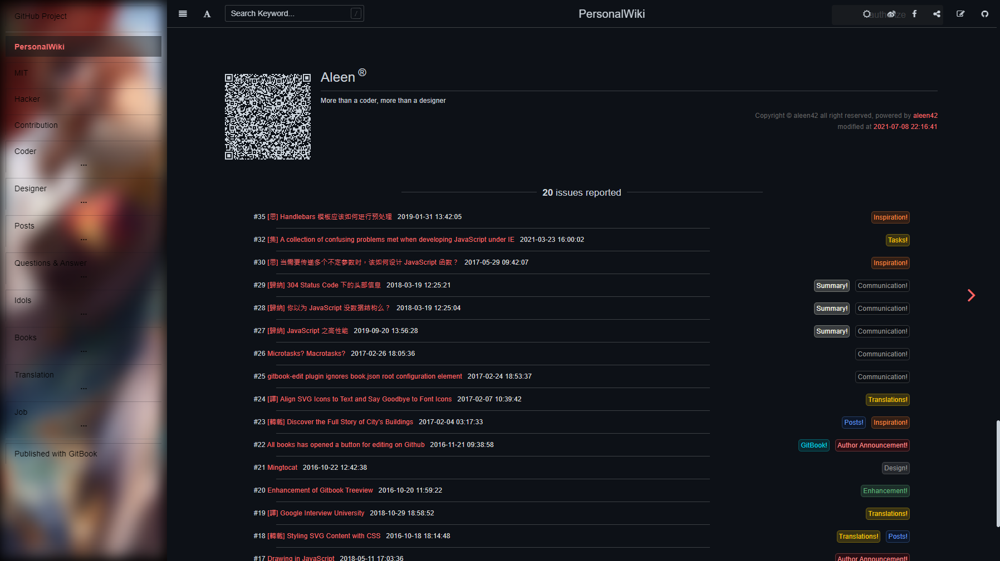

## page-footer

[](#) [](https://github.com/aleen42/gitbook-footer/issues) [](https://raw.githubusercontent.com/aleen42/gitbook-footer/master/LICENSE) [](https://gitter.im/aleen42/gitbook-footer?utm_source=badge&utm_medium=badge&utm_campaign=pr-badge) 

[](https://www.npmjs.com/package/gitbook-plugin-page-footer) [](https://travis-ci.org/aleen42/gitbook-footer) [](https://github.com/aleen42/gitbook-footer) [](https://david-dm.org/aleen42/gitbook-footer#info=devDependencies)

a gitbook-plugin for adding footer.



#### Installation

###### NPM Installation

```bash
npm install page-footer
cd ./node_modules/page-footer
npm i
```

###### Clone Installation

```bash
git clone https://github.com/aleen42/gitbook-footer.git
cd gitbook-footer
npm i
```

#### Usage

just find plugin on gitbook and install it on your gitbook project.

configuration option can be set as an obj like, and of course you can use a default value shown as followed:

```json
{
	"plugins": [
		"page-footer"
	],
	"pluginsConfig": {
		"page-footer": {
			"description": "modified at",
			"author": "Aleen",
			"wisdom": "More than a coder, more than a designer",
			"format": "YYYY-MM-DD HH:mm:ss",
			"copyright": "Copyright &#169; aleen42",
			"timeColor": "#666",
			"copyrightColor": "#666",
			"utcOffset": "8",
			"qrcode": true,
			"baseUri": "https://aleen42.gitbooks.io/personalwiki/content/"
		}
	}
}
```

#### Tests

```bash
npm test
```

#### Release History

* ==================== **1.0.0 Initial release** ====================
	* 1.0.1 fix bugs
	* 1.0.2 fix bugs
	* 1.0.3 fix bugs
	* 1.0.4 fix bugs
	* 1.0.5 fix bugs
	* 1.0.6 update readme
	* 1.0.7 update package.json
	* 1.0.8 update readme
	* 1.0.9 update readme
	* 1.1.0 version restrict
	* 1.1.1 configuration
	* 1.1.2 configuration
	* 1.1.3 fix bugs
	* 1.1.4 fix bugs
	* 1.1.5 fix bugs
	* 1.1.6 fix bugs
	* 1.1.7 fix bugs
	* 1.1.8 fix bugs
	* 1.1.9 debug mode
	* 1.2.0 debug mode
	* 1.2.1 debug mode
	* 1.2.2 debug mode
	* 1.2.3 debug mode
	* 1.2.4 debug mode
	* 1.2.5 unused version
	* 1.2.6 unused version
	* 1.2.7 unused version
	* 1.2.8 unused version
	* 1.2.9 unused version
	* 1.3.0 unused version
	* 1.3.1 unused version
	* 1.3.2 unused version
	* ================ **1.3.3 released version** ================
	* 1.3.4 add title
	* 1.3.5 unused version
	* 1.3.6 unused version
	* 1.3.7 unused version
	* 1.3.8 unused version
	* 1.3.9 unused version
	* 1.4.0 unused version
	* 1.4.1 unused version
	* 1.4.2 unused version
	* ================ **1.4.3 released version** ================
	* 1.4.4 unused version
	* 1.4.5 unused version
	* ================ **1.4.6 released version** ================
	* 1.4.7 unused version
	* 1.4.8 update readme
	* 1.4.9 update readme
* ==================== **2.0.0 Featuring configuration** ====================
	* 2.0.1 update readme
	* 2.0.2 update dependency version
	* 2.0.3 update readme
	* 2.0.4 update readme
	* 2.0.5 update readme
	* 2.0.6 update readme
	* 2.0.7 update readme
	* 2.0.8 update readme
	* 2.0.9 update readme
	* 2.1.0 update readme
	* 2.1.1 update style
	* 2.1.2 unused version
	* 2.1.3 featuring Timezone
	* 2.1.4 fix bugs
	* 2.1.5 fix bugs
	* 2.1.6 fix bugs
	* 2.1.7 update readme
	* 2.1.8 unused version
	* 2.1.9 unused version
	* 2.2.0 unused version
	* 2.2.1 unused version
	* 2.2.2 unused version
	* 2.2.3 unused version
	* 2.2.4 unused version
	* 2.2.5 unused version
	* 2.2.6 unused version
	* 2.2.7 unused version
	* 2.2.8 unused version
	* 2.2.9 unused version
	* 2.3.0 unused version
	* 2.3.1 unused version
	* 2.3.2 unused version
	* 2.3.3 unused version
	* 2.3.4 unused version
	* 2.3.5 unused version
	* 2.3.6 unused version
	* 2.3.7 unused version
	* 2.3.8 unused version
	* 2.3.9 unused version
	* 2.4.0 unused version
	* 2.4.1 unused version
	* 2.4.2 unused version
	* 2.4.3 unused version
	* 2.4.4 unused version
	* 2.4.5 unused version
	* 2.4.6 unused version
	* 2.4.7 unused version
	* 2.4.8 unused version
	* 2.4.9 unused version
	* 2.5.0 unused version
	* 2.5.1 unused version
	* 2.5.2 unused version
	* 2.5.3 unused version
	* 2.5.4 unused version
	* 2.5.5 unused version
	* 2.5.6 unused version
	* 2.5.7 unused version
	* 2.5.8 unused version
	* 2.5.9 unused version
	* 2.6.0 unused version
	* 2.6.1 unused version
	* 2.6.2 unused version
	* 2.6.3 unused version
	* 2.6.4 unused version
	* 2.6.5 unused version
	* 2.6.6 unused version
	* 2.6.7 unused version
	* 2.6.8 unused version
	* 2.6.9 unused version
	* 2.7.0 unused version
	* 2.7.1 unused version
	* 2.7.2 unused version
	* 2.7.3 unused version
	* 2.7.4 unused version
	* 2.7.5 unused version
	* 2.7.6 unused version
	* 2.7.7 unused version
	* 2.7.8 unused version
	* 2.7.9 unused version
	* 2.8.0 unused version
	* 2.8.1 unused version
	* 2.8.2 unused version
	* 2.8.3 unused version
	* 2.8.4 unused version
	* 2.8.5 unused version
	* 2.8.6 unused version
	* 2.8.7 unused version
	* 2.8.8 unused version
	* 2.8.9 unused version
* ==================== **3.0.0 Featuring Qrcode** ====================
	* 3.0.1 update style
	* 3.0.2 unused version
	* 3.0.3 unused version
	* 3.0.4 unused version
	* 3.0.5 unused version
	* 3.0.6 fix bugs
	* 3.0.7 justify style for mobile
	* 3.0.8 justify style for mobile
	* 3.0.9 support optional styles
	* 3.1.0 featuring style of symmetrial
	* 3.1.1 fix bugs
	* 3.1.2 fix bugs
	* 3.1.3 fix bugs
	* 3.1.4 fix bugs

#### :fuelpump: How to contribute

Have an idea? Found a bug? See [how to contribute](https://aleen42.gitbooks.io/personalwiki/content/contribution.html).

#### :scroll: License

[MIT](https://aleen42.gitbooks.io/personalwiki/content/MIT.html) © aleen42
